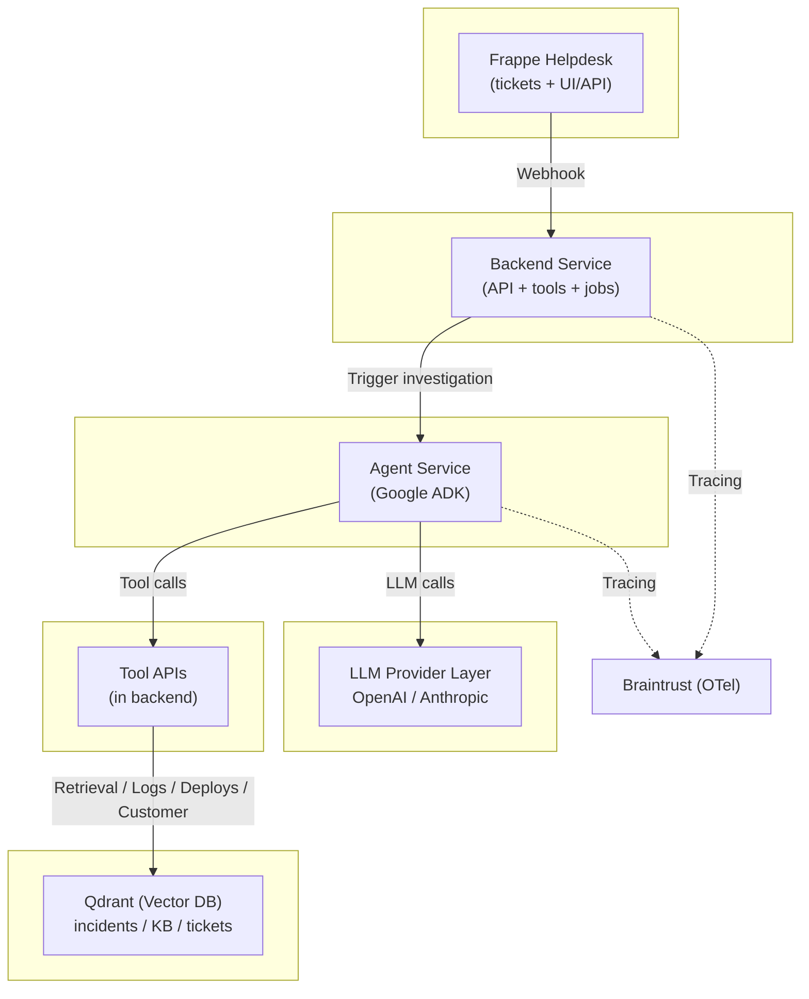

# Support Desk Investigator

An end-to-end, locally runnable demo of an **LLM-powered support ticket investigator** designed to showcase:

- Multi-step agent workflows (planning + tool use + verification)
- Real observability with OpenTelemetry
- Braintrust-powered trace inspection and evaluation
- A measurable **“bad → good”** improvement loop

This project is intentionally structured to demonstrate modern LLM engineering practices — not just prompting, but tracing, tooling, and eval-driven iteration.

## Table of Contents

- [1. Core Concept](#1-core-concept)
- [2. Architecture Overview](#2-architecture-overview)
- [3. Technology Stack](#3-technology-stack)
- [4. Repository Structure](#4-repository-structure)
- [5. Running Locally](#5-running-locally)
- [6. Demo: Bad → Good](#6-demo-bad-good)
- [7. Evaluation Strategy](#7-evaluation-strategy)
- [8. Variant Design](#8-variant-design)
- [9. Deterministic Demo Mode](#9-deterministic-demo-mode)
- [10. Observability Model](#10-observability-model)
- [11. Security Considerations (Demo Scope)](#11-security-considerations-demo-scope)
- [12. Roadmap](#12-roadmap)
- [13. References](#13-references)
- [14. Why This Project Exists](#14-why-this-project-exists)

# 1. Core Concept

When a support ticket is created:

1. The system ingests the ticket from **Frappe Helpdesk**
2. A multi-step agent (Google ADK) investigates using tools:
   - Similar incidents (Qdrant)
   - Logs
   - Deploy history
   - Customer context
3. It produces:
   - A customer reply draft
   - Internal engineering notes
   - An evidence bundle
   - Confidence + escalation guidance
4. Every step is traced with **OpenTelemetry**
5. Traces are exported to **Braintrust**
6. Evaluations score the investigation quality

You can run the system in:

- `VARIANT=baseline` (weak guardrails, shallow retrieval)
- `VARIANT=improved` (schema enforcement, required tools, better retrieval, confidence gating)

Then compare the results.

# 2. Architecture Overview

## Services (Docker Compose)

| Service | Purpose | Status |
|----------|----------|--------|
| frappe-helpdesk | Ticket UI + ticket storage + webhooks | ✅ Running |
| backend | Webhook receiver + tool API + Frappe integration | ✅ Running |
| agent | Google ADK workflow + LLM calls (Claude 3.5 Sonnet) | ✅ Running |
| qdrant | Vector DB for similar incidents (local embeddings) | ✅ Running |
| mariadb | Database for Frappe | ✅ Running |
| redis | Cache and queue backend | ✅ Running |
| customer-app | React frontend for ticket generation | ⏳ Ready (not in compose yet) |
| demo-logs | Deterministic log backend for demos | 🔜 Planned |

## High-Level Flow

**Current Implementation (v0.3.0):**

```
Customer Portal (customer-app)
  → Ticket Created (Frappe)
  → Webhook Event (Frappe → Backend)
  → Case File Normalization (Backend)
  → Investigation Request (Backend → Agent)
  → ADK Workflow (4 phases)
    ├─ Triage: Category, severity, required tools
    ├─ Gather: Evidence from tools (logs, incidents, deploys, customer)
    ├─ Verify: Analyze evidence, calculate confidence
    └─ Finalize: Generate customer reply + internal notes
  → Results Posted (Backend → Frappe)
    ├─ Internal Notes (Comment doctype)
    ├─ Customer Communication (Communication doctype, visible in portal)
    └─ Tags & Metadata
```

**Planned (Day 6+):**
```
Tracing spans emitted throughout → Braintrust (OpenTelemetry)
```

## System diagram



# 3. Technology Stack

### Ticketing & Communication
- **Frappe Helpdesk** (v16) - Open source ticket management
- **Frappe API** - Full integration for webhooks, comments, and customer communications

### Customer Portal
- **React + TypeScript** - Frontend for ticket simulation
- **Vite** - Build tooling
- **shadcn-ui + Tailwind CSS** - UI components and styling

### Agent Orchestration
- **Google Agent SDK (ADK)** - Multi-agent workflow framework
- **SequentialAgent Pattern** - 4-phase investigation (Triage → Gather → Verify → Finalize)

### LLM Provider
- **Anthropic Claude 3.5 Sonnet** - Agent reasoning and generation
- LiteLLM provider abstraction (via ADK)

### Embeddings & Retrieval
- **Qdrant v1.16.3** - Vector database
- **sentence-transformers/all-MiniLM-L6-v2** - Local embeddings (no API calls)
- 20 sample incidents pre-ingested

### Backend Services
- **FastAPI** - Backend and agent HTTP services
- **Python 3.12** - Runtime
- **UV** - Package management

### Observability (Planned - Day 6)
- **OpenTelemetry** - Distributed tracing
- **Braintrust** - Trace inspection and evaluation

### Infrastructure
- **Docker + Docker Compose** - Service orchestration
- **MariaDB 11.8** - Persistent storage
- **Redis 6.2** - Cache and queue backend

# 4. Repository Structure

```
projects/support-desk-investigator/
├── docker-compose.yml           # All services orchestration
├── src/
│   ├── backend/                 # Backend API service
│   │   ├── app.py              # FastAPI application
│   │   ├── frappe_client.py    # Frappe API integration
│   │   └── routes/
│   │       ├── webhooks.py     # Webhook receiver
│   │       └── tools.py        # Tool endpoints
│   ├── agent/                   # Agent service
│   │   ├── app.py              # FastAPI wrapper
│   │   ├── adk_workflow.py     # Google ADK workflow
│   │   └── adk_tools.py        # ADK function tools
│   ├── customer-app/            # React frontend (ticket simulator)
│   │   ├── src/                # React components
│   │   └── public/             # Static assets
│   ├── common/                  # Shared schemas
│   │   └── schemas.py          # CaseFile, InvestigationResult
│   ├── evals/                   # Evaluation framework (planned)
│   │   ├── scorers.py
│   │   └── datasets/
│   ├── main.py                  # Main entry point (placeholder)
│   └── eval.py                  # Evaluation runner (placeholder)
├── scripts/
│   ├── init_frappe.sh          # Frappe initialization
│   ├── init_frappe_users.py    # User/customer setup
│   ├── ingest-qdrant.py        # Vector DB ingestion
│   └── backend-entrypoint.sh   # Backend startup script
├── data/
│   └── sample_incidents.json   # Incident dataset (20 samples)
└── docs/
    ├── quickstart.md           # Getting started guide
    ├── planning.md             # Project goals
    ├── implementation.md       # Technical decisions
    ├── architecture.md         # System design
    ├── changelog.md            # Version history
    └── issues.md               # Known issues
```

# 5. Running Locally

> **Quick Start**: For step-by-step setup instructions, see **[docs/quickstart.md](docs/quickstart.md)**

## 5.1 Prerequisites

- Docker + Docker Compose
- Braintrust account + API key
- OpenAI and/or Anthropic API key

## 5.2 Environment Setup

Create `.env` from the template:

```bash
cp .env.example .env
```

Required configuration:

```bash
# LLM Provider (required for agent reasoning)
ANTHROPIC_API_KEY=your-anthropic-key-here

# Braintrust (optional - for observability, Day 6+)
BRAINTRUST_API_KEY=your-braintrust-key-here
BRAINTRUST_PROJECT=support-desk-investigator

# Variant toggle
VARIANT=baseline  # or "improved"

# Service URLs (defaults work for Docker Compose)
BACKEND_URL=http://backend:8000
AGENT_URL=http://agent:8001
FRAPPE_URL=http://frappe:8080
QDRANT_URL=http://qdrant:6333
```

**Note:** OpenAI API key is not required - the system uses local sentence-transformers for embeddings and Anthropic Claude for agent reasoning.

## 5.3 Start All Services

```bash
docker compose up --build
```

**First run takes 5-10 minutes** as Frappe initializes and backend seeds data. Monitor progress:

```bash
# Watch initialization
docker compose logs -f frappe backend
```

Look for:
- Frappe: `✅ Initialization complete!`
- Backend: `✅ Qdrant ingestion complete!` + `✅ Frappe users initialized!`

**Subsequent runs are much faster (~30 seconds)** as initialization is idempotent.

### Service Endpoints

| Service | URL | Credentials |
|---------|-----|-------------|
| **Frappe Helpdesk** | http://localhost:8080 | Administrator / admin123 |
| **Backend API** | http://localhost:8000/docs | - |
| **Agent Service** | http://localhost:8001/docs | - |
| **Qdrant Dashboard** | http://localhost:6333/dashboard | - |

### Pre-Configured Accounts

The system automatically creates:
- **Service Account**: Helpdesk Assistant (helpdesk-assistant@example.com) - for automated responses
- **Demo Customer**: John Doe (john.doe@acmecorp.com) from Acme Corporation - for ticket creation
- **Admin**: Administrator (admin@example.com) - for Frappe management

# 6. Creating Test Tickets

## Option 1: Frappe UI (Current)

1. Open http://localhost:8080
2. Login as **Administrator** / **admin123**
3. Navigate to **Helpdesk** → **New Ticket**
4. Fill in:
   - **Contact**: john.doe@acmecorp.com (demo customer)
   - **Subject**: "Checkout returning 502 errors"
   - **Description**: "Customers reporting intermittent 502 on checkout since 9:30 AM"
   - **Priority**: High
5. Save

The webhook will trigger automatically and you'll see:
- Investigation progress in backend/agent logs
- Internal notes added to the ticket (Comment doctype)
- Customer communication visible at http://localhost:8080/helpdesk/tickets/{ticket-id}

## Option 2: Customer Portal App (Available)

The `src/customer-app/` contains a React frontend that simulates realistic customer error scenarios:

**Scenarios included:**
- **Shop**: Checkout Timeout, Payment Order Split
- **Analytics**: Dashboard Timeout, Export Failed
- **Pay**: Transfer Pending, Duplicate Charge
- **Travel**: Ticketing Failed, Price Changed

**To use:**
```bash
cd src/customer-app
npm install
npm run dev
```

Open http://localhost:5173 and click through error scenarios to generate realistic tickets.

**Status:** Ready but not yet integrated with Docker Compose. Tickets must be manually created in Frappe UI for now.

---

# 7. Demo: Bad → Good (Planned)

> **Note:** Variant comparison is planned for Day 7. The infrastructure is in place (VARIANT environment variable) but differentiated behaviors are not yet implemented.

## Current Demo (v0.3.0)

**What works now:**
1. Create ticket in Frappe UI
2. Webhook triggers backend → agent investigation
3. ADK workflow runs 4 phases (Triage → Gather → Verify → Finalize)
4. Tools are called: incident search, logs, deploys, customer context
5. Results posted back to Frappe:
   - Internal notes with evidence summary
   - Customer communication (visible in portal)
   - Confidence score and escalation decision

**To observe:**
```bash
# Watch the investigation in real-time
docker compose logs -f backend agent

# Check Frappe ticket for results
# Internal view: http://localhost:8080/desk/hd-ticket/{id}
# Customer view: http://localhost:8080/helpdesk/tickets/{id}
```

## Future: Baseline vs Improved (Day 7)

Once implemented, you'll be able to run:

```bash
# Baseline: Minimal guardrails, shallow retrieval
VARIANT=baseline docker compose up --build

# Improved: Strict schema, required tools, confidence gating
VARIANT=improved docker compose up --build
```

And compare results in Braintrust traces and eval scores.

# 8. Evaluation Strategy (Planned - Day 7)

Two evaluation modes are planned:

## 8.1 Offline Regression Eval

- Uses fixed dataset of tickets
- Deterministic tool outputs (record/replay mode)
- Compares baseline vs improved variants

**Planned scorers:**
- Schema validity
- Evidence grounding
- Required tool usage
- Helpfulness / tone (LLM-as-judge)
- Confidence calibration

## 8.2 Online Sampling Eval

- Scores a subset of real ticket investigations
- Monitors drift and regressions

**Status:** Infrastructure ready, scorers not yet implemented.

# 9. Variant Design (Planned - Day 7)

The variant toggle is configuration-based (VARIANT environment variable).

### Baseline (Planned)
- Minimal schema enforcement
- Shallow retrieval (low top-k)
- No required tool calls
- No escalation logic
- May hallucinate or be overconfident

### Improved (Planned)
- Strict output schema validation
- Required evidence bundle
- Enforced tool invocation rules (e.g., error → must query logs)
- Higher retrieval depth + query rewriting
- Confidence gating (low confidence → request more info / escalate)

**Current:** Both variants use the same ADK workflow. Differentiation will be added in Day 7.

# 10. Deterministic Demo Mode (Planned)

For stable demos and reproducible evals, a record/replay system is planned:

```bash
RECORD_MODE=record   # Save tool responses to fixtures
RECORD_MODE=replay   # Serve responses from fixtures
```

**Benefits:**
- Ensures repeatable runs for eval comparison
- Eliminates nondeterminism from LLM tool outputs
- Allows offline testing without live dependencies

**Status:** Infrastructure planned, not yet implemented. Consider using `temperature=0` for now.

# 11. Observability Model (Day 6 - Planned)

Once OpenTelemetry is integrated, every investigation will produce:

**Root trace** (keyed by ticket.id):
- Spans for each workflow phase:
  - `webhook.receive` (backend)
  - `case_file.normalize` (backend)
  - `agent.investigate` (backend → agent)
    - `triage_phase` (agent)
    - `gather_phase` (agent)
      - `tool.query_logs` (tool call)
      - `tool.search_incidents` (tool call)
      - `tool.get_deploys` (tool call)
    - `verify_phase` (agent)
    - `finalize_phase` (agent)
  - `frappe.post_results` (backend)

**Span attributes:**
- `variant` - baseline/improved
- `ticket.id` - HD-000123
- `ticket.priority` - high/medium/low
- `customer.tier` - enterprise/business/free
- `tool.name` - query_logs, search_incidents, etc.
- `tool.result_count` - number of results
- `llm.provider` - anthropic
- `llm.model` - claude-3-5-sonnet-20241022
- `llm.tokens.prompt` - token count
- `llm.tokens.completion` - token count
- `investigation.confidence` - 0.0-1.0
- `investigation.should_escalate` - true/false

**Export:** Via Braintrust OTel SDK integration to https://www.braintrust.dev

**Current Status:** Logging only (console output). OpenTelemetry instrumentation planned for Day 6.

# 12. Security Considerations (Demo Scope)

**Current implementation:**
- ✅ `.env` excluded from version control
- ✅ API keys never logged or posted to tickets
- ✅ Basic auth for Frappe API (base64-encoded API key:secret)
- ✅ CORS middleware configured for demo (allow all origins)

**Recommendations for production:**
- Use proper authentication/authorization (OAuth, JWT)
- Implement rate limiting on webhook endpoints
- Redact PII from logs and traces
- Use secrets management (e.g., AWS Secrets Manager, Vault)
- Restrict CORS to known origins
- Add input validation and sanitization
- Implement audit logging for compliance

# 12. Roadmap

## Completed (v0.3.0)

- ✅ Docker Compose full integration (Day 1)
- ✅ Frappe Helpdesk infrastructure with automated initialization (Day 1)
- ✅ Backend webhook + tool endpoints (Day 2)
- ✅ ADK workflow implementation with 4-phase investigation (Day 3)
- ✅ Qdrant ingestion pipeline with local embeddings (Day 4)
- ✅ Idempotent deployment system (Day 4)
- ✅ Complete Frappe API integration (Day 5)
  - Service account for automated responses
  - Demo customer account
  - Customer-facing communications in portal
  - Internal notes and drafts
- ✅ Customer-app frontend for ticket generation
- ✅ Comprehensive documentation

## In Progress

- 🚧 OpenTelemetry instrumentation (Day 6 - planned)
- 🚧 Braintrust exporter wiring (Day 6 - planned)

## Planned

- [ ] Variant toggles (baseline vs improved) (Day 7)
- [ ] Offline eval runner with custom scorers (Day 7)
- [ ] Record/replay mode for deterministic demos
- [ ] Customer-app integration with Docker Compose
- [ ] Real log aggregation system integration
- [ ] Expanded test dataset (20+ scenarios)

# 13. References

**Technologies:**
- [Frappe Helpdesk](https://github.com/frappe/helpdesk) - Open source ticketing system
- [Google ADK](https://google.github.io/adk-docs/) - Agent Development Kit
- [Anthropic Claude](https://www.anthropic.com/api) - LLM provider
- [Qdrant](https://qdrant.tech/) - Vector database
- [sentence-transformers](https://www.sbert.net/) - Local embeddings
- [Braintrust](https://www.braintrust.dev/) - Observability and evaluation platform
- [Braintrust OTel Integration](https://www.braintrust.dev/docs/integrations/sdk-integrations/opentelemetry) - OpenTelemetry exporter

**Documentation:**
- [Quick Start Guide](docs/quickstart.md) - Setup instructions
- [Architecture](docs/architecture.md) - System design and data flow
- [Planning](docs/planning.md) - Project goals and milestones
- [Implementation](docs/implementation.md) - Technical decisions and progress
- [Changelog](docs/changelog.md) - Version history
- [Issues](docs/issues.md) - Known issues and limitations

# 14. Why This Project Exists

This is **not just a chatbot demo**.

It is a demonstration of **modern LLM engineering practices**:

✅ **Multi-step agent workflows** - Not just prompt → response, but planning → evidence gathering → verification → synthesis

✅ **Tool-rich investigations** - Real integration with retrieval, logs, deploys, and customer context

✅ **Structured outputs** - Not vibes-based, but schema-validated results with confidence scores

✅ **Observability-first** - Every step traced and inspectable (Day 6+)

✅ **Eval-driven improvement** - Measurable quality metrics, not just "it feels better"

✅ **End-to-end integration** - From customer portal to ticket to investigation to resolution

✅ **Production-ready patterns** - Idempotent deployment, service accounts, proper attribution

**The goal:** Make AI system improvements **visible, reproducible, and defensible**.
