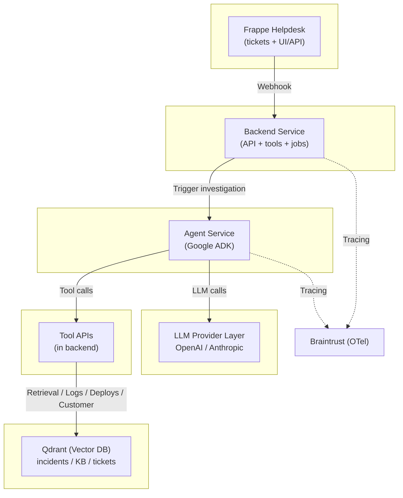

# Support Desk Investigator

An end-to-end, locally runnable demo of an **LLM-powered support ticket investigator** designed to showcase:

- Multi-step agent workflows (planning + tool use + verification)
- Real observability with OpenTelemetry
- Braintrust-powered trace inspection and evaluation
- A measurable **“bad → good”** improvement loop

This project is intentionally structured to demonstrate modern LLM engineering practices — not just prompting, but tracing, tooling, and eval-driven iteration.

## Table of Contents

- [1. Core Concept](#1-core-concept)
- [2. Architecture Overview](#2-architecture-overview)
- [3. Technology Stack](#3-technology-stack)
- [4. Repository Structure](#4-repository-structure)
- [5. Running Locally](#5-running-locally)
- [6. Demo: Bad → Good](#6-demo-bad-good)
- [7. Evaluation Strategy](#7-evaluation-strategy)
- [8. Variant Design](#8-variant-design)
- [9. Deterministic Demo Mode](#9-deterministic-demo-mode)
- [10. Observability Model](#10-observability-model)
- [11. Security Considerations (Demo Scope)](#11-security-considerations-demo-scope)
- [12. Roadmap](#12-roadmap)
- [13. References](#13-references)
- [14. Why This Project Exists](#14-why-this-project-exists)

# 1. Core Concept

When a support ticket is created:

1. The system ingests the ticket from **Frappe Helpdesk**
2. A multi-step agent (Google ADK) investigates using tools:
   - Similar incidents (Qdrant)
   - Logs
   - Deploy history
   - Customer context
3. It produces:
   - A customer reply draft
   - Internal engineering notes
   - An evidence bundle
   - Confidence + escalation guidance
4. Every step is traced with **OpenTelemetry**
5. Traces are exported to **Braintrust**
6. Evaluations score the investigation quality

You can run the system in:

- `VARIANT=baseline` (weak guardrails, shallow retrieval)
- `VARIANT=improved` (schema enforcement, required tools, better retrieval, confidence gating)

Then compare the results.

# 2. Architecture Overview

## Services (Docker Compose)

| Service | Purpose |
|----------|----------|
| frappe-helpdesk | Ticket UI + ticket storage |
| backend | Webhook receiver + tool API + orchestration |
| agent | Google ADK workflow + LLM calls |
| qdrant | Vector DB for similar incidents |
| redis *(optional)* | Async job queue |
| demo-logs *(optional)* | Deterministic log backend for demos |

## High-Level Flow

Ticket → Webhook → Backend → Agent → Tools → Result → Ticket update  
Tracing spans emitted throughout → Braintrust

## System diagram



# 3. Technology Stack

### Ticketing
- Frappe Helpdesk (open source)

### Agent Orchestration
- Google Agent SDK (ADK)

### LLM Providers
- OpenAI
- Anthropic
(abstracted via provider layer)

### Retrieval
- Qdrant (vector DB)

### Observability
- OpenTelemetry
- Braintrust OTel SDK integration

### Runtime
- Docker + Docker Compose

# 4. Repository Structure

Planned structure:

```
src/
  backend/
    api.py
    tools_api.py
    frappe_client.py
  agent/
    workflow.py
    tools.py
    providers.py
  evals/
    scorers.py
    datasets/
  common/
    schemas.py
    tracing.py
docs/
  planning.md
  implementation.md
  architecture.md
  issues.md
```

Current repo contains bootstrap files that will evolve into this structure.

# 5. Running Locally

## 5.1 Prerequisites

- Docker + Docker Compose
- Braintrust account + API key
- OpenAI and/or Anthropic API key

## 5.2 Environment Setup

Create `.env`:

```
BRAINTRUST_API_KEY=...
BRAINTRUST_PROJECT=Support Desk Investigator
OPENAI_API_KEY=...
ANTHROPIC_API_KEY=...
VARIANT=baseline
```

## 5.3 Start All Services

```
docker compose up --build
```

Expected local endpoints (example):

- Frappe Helpdesk: http://localhost:8080
- Backend API: http://localhost:8000
- Agent Service: http://localhost:8001
- Qdrant: http://localhost:6333

# 6. Demo: Bad → Good

## Step 1: Baseline

Run:

```
VARIANT=baseline docker compose up --build
```

Create a ticket like:

“Customer reports intermittent 502 on checkout.”

Expected behavior:
- Weak investigation
- Possibly no evidence bundle
- May hallucinate root cause
- Overconfident output

Open Braintrust:
- Inspect trace
- Observe tool usage (or lack thereof)

## Step 2: Improved

Stop and restart with:

```
VARIANT=improved docker compose up --build
```

Recreate or replay the same ticket.

Expected improvements:
- Evidence references included
- Required tools invoked
- Structured JSON output
- Confidence gating
- Cleaner internal notes

Compare trace spans + eval scores.

# 7. Evaluation Strategy

Two evaluation modes:

## 7.1 Offline Regression Eval

- Uses fixed dataset of tickets
- Deterministic tool outputs (record/replay mode)
- Compares baseline vs improved variants

Scorers include:
- Schema validity
- Evidence grounding
- Required tool usage
- Helpfulness / tone (LLM-as-judge)

## 7.2 Online Sampling Eval

- Scores a subset of real ticket investigations
- Monitors drift and regressions

# 8. Variant Design

The variant toggle is configuration-based (not branch-based).

### Baseline
- Minimal schema
- Shallow retrieval (low top-k)
- No tool requirements
- No escalation logic

### Improved
- Strict output schema
- Required evidence bundle
- Required tool invocation rules
- Higher retrieval depth
- Confidence + escalation policy

# 9. Deterministic Demo Mode

For stable demos:

```
RECORD_MODE=record
RECORD_MODE=replay
```

Record mode:
- Saves tool responses to fixtures

Replay mode:
- Serves responses from fixtures
- Ensures repeatable runs for eval comparison

# 10. Observability Model

Every investigation produces:

- A root trace (ticket.id)
- Spans for:
  - triage
  - each tool call
  - each LLM call
  - verification step
  - finalize step

Span attributes include:
- variant
- ticket.id
- tool.name
- llm.provider
- llm.model
- latency
- error flags

Exported via Braintrust OTel SDK integration.

# 11. Security Considerations (Demo Scope)

- Do not expose API keys in tickets
- Redact sensitive tokens in logs
- Keep `.env` out of version control
- Safe mode toggle for external calls

# 12. Roadmap

- [ ] Docker Compose full integration
- [ ] Backend webhook + tool endpoints
- [ ] ADK workflow implementation
- [ ] Qdrant ingestion pipeline
- [ ] OpenTelemetry instrumentation
- [ ] Braintrust exporter wiring
- [ ] Variant toggles
- [ ] Offline eval runner
- [ ] Demo fixtures

# 13. References

- Frappe Helpdesk: https://github.com/frappe/helpdesk
- Google ADK: https://google.github.io/adk-docs/
- Braintrust OTel Integration: https://www.braintrust.dev/docs/integrations/sdk-integrations/opentelemetry
- Qdrant: https://qdrant.tech/

# 14. Why This Project Exists

This is not just a chatbot demo.

It is a demonstration of:
- How to build multi-step AI systems responsibly
- How to observe and debug them
- How to prevent regressions with evals
- How to move from “vibes” to measurable quality

The goal is to make the improvement visible, reproducible, and defensible.
