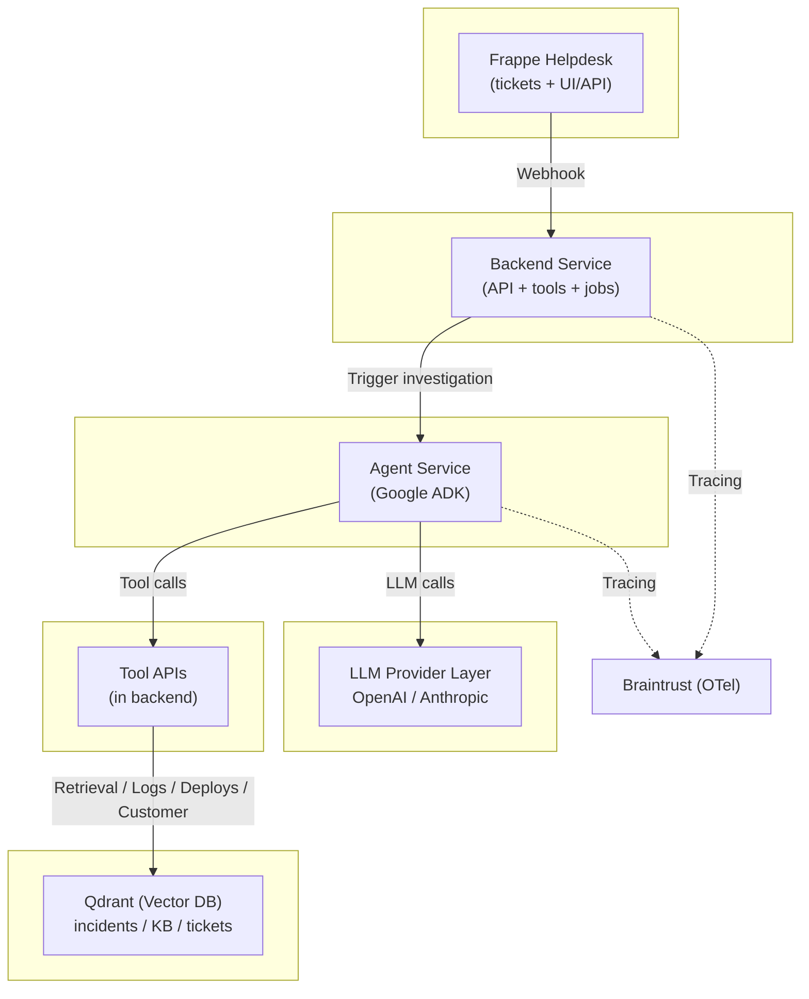

# Architecture - Support Desk Investigator

**Last Updated:** 2026-02-20

This document describes the target architecture for the Support Desk Investigator demo:
- Frappe Helpdesk for ticketing
- Google Agent SDK (ADK) for agent orchestration
- OpenAI/Anthropic as LLM providers
- Qdrant for retrieval (similar incidents / KB)
- OpenTelemetry tracing exported to Braintrust via Braintrust SDK integration

---

## 1. High-level goals

1) **Event-driven**: ticket events trigger investigations  
2) **Tool-rich**: the agent uses tools for evidence (logs, retrieval, deploy history, customer context)  
3) **Observable**: every step and tool call is traced with OpenTelemetry  
4) **Measurable**: baseline vs improved variants are evaluated with scorers and can be compared

---

## 2. System diagram (logical)



---

## 3. Runtime diagram (Docker Compose)

```
docker compose up
  - frappe-helpdesk (plus its DB/cache deps)
  - qdrant
  - backend
  - agent
  - optional: redis + worker
  - optional: demo-logs (for deterministic evidence in demos)
```

---

## 4. Data flow: from ticket to investigation result

### 4.1 Ticket event → case file
1) A ticket is created/updated in Frappe
2) Frappe sends a webhook to the backend
3) Backend normalizes the event into a `CaseFile` (canonical object)
4) Backend triggers the agent workflow and passes the `case_file_id` (or inline case_file)

### 4.2 Agent workflow (ADK)
The agent performs:
1) **Triage**: category, severity, probable service, missing info
2) **Plan**: decide which tools to call and in what order
3) **Evidence gathering**: retrieval + logs + deploys + customer context
4) **Hypotheses**: generate plausible causes + verification steps
5) **Verification**: run targeted tool queries
6) **Finalize**: produce customer reply + internal notes + actions + confidence

### 4.3 Results back to Frappe
Backend posts to ticket via Frappe API:
- **Internal note** (Comment doctype): Evidence summary, confidence, escalation decision
- **Customer reply draft** (Comment/Info doctype): Suggested response for agent review
- **Customer communication** (Communication doctype): Automated response visible in portal
  - Attributed to "Helpdesk Assistant" service account
  - Uses communication_medium="Email" for portal visibility
- **Tags**: auto-investigated, needs-escalation, confidence-level tags
- **Status updates**: (optional, not currently implemented)

---

## 5. Key design choice: tools via backend (recommended)

**Tools should be exposed as backend HTTP endpoints** rather than direct DB/log access from the agent.

Benefits:
- central place for auth and rate limiting
- easier record/replay for deterministic evals
- simpler agent code (tool calls are just HTTP)
- consistent tracing and logging

---

## 6. Configuration model (variants)

Two variants are supported via config (env var):

### Baseline (`VARIANT=baseline`)
- minimal output schema
- shallow retrieval (small top-k)
- no tool requirements
- no confidence gating (often overconfident)

### Improved (`VARIANT=improved`)
- strict output schema
- evidence bundle required
- tool-call requirements (e.g., error signature => must query logs)
- stronger retrieval (rewrites + higher top-k)
- confidence gating:
  - low confidence => request more info / escalate

---

## 7. Canonical schemas

### 7.1 Webhook envelope (from Frappe to backend)

Backend should accept a minimal envelope, and may fetch full ticket details via Frappe API.

```json
{
  "event": "ticket.created",
  "ticket_id": "HD-000123",
  "timestamp": "2026-02-17T10:15:30Z",
  "meta": {
    "source": "frappe-helpdesk",
    "tenant": "local"
  }
}
```

Supported events (suggested):
- `ticket.created`
- `ticket.updated`
- `ticket.comment_added`
- `ticket.status_changed`

### 7.2 CaseFile (backend canonical object)

```json
{
  "case_file_id": "cf_01J...",
  "ticket": {
    "id": "HD-000123",
    "subject": "Checkout returning 502",
    "body": "Customer reports intermittent 502 on checkout since 09:30...",
    "created_at": "2026-02-17T09:42:00Z",
    "updated_at": "2026-02-17T10:15:30Z",
    "tags": ["checkout", "502"],
    "priority": "high"
  },
  "customer": {
    "id": "cust_123",
    "name": "ACME Ltd",
    "tier": "enterprise",
    "region": "eu-west"
  },
  "context": {
    "environment": "prod",
    "suspected_service": "checkout-api",
    "time_window": {
      "start": "2026-02-17T09:00:00Z",
      "end": "2026-02-17T10:30:00Z"
    },
    "error_signatures": [
      {
        "type": "http_status",
        "value": "502"
      }
    ]
  },
  "attachments": [
    {
      "name": "screenshot.png",
      "url": "https://..."
    }
  ]
}
```

### 7.3 InvestigationResult (agent output, posted back to ticket)

Strict schema should be used in `VARIANT=improved`.

```json
{
  "ticket_id": "HD-000123",
  "variant": "improved",
  "summary": "Likely upstream timeout in checkout-api due to recent deploy + spike in DB latency.",
  "customer_reply": "Thanks for reporting this. We’re investigating intermittent 502s on checkout...",
  "internal_notes": "Observed elevated 502s from 09:30–10:10. Correlates with deploy dpl_456...",
  "hypotheses": [
    {
      "title": "DB connection pool exhaustion",
      "confidence": 0.55,
      "evidence_ids": ["log_abc", "deploy_dpl_456"]
    },
    {
      "title": "Upstream payment provider latency",
      "confidence": 0.25,
      "evidence_ids": ["log_xyz"]
    }
  ],
  "actions": [
    {
      "type": "ask_for_info",
      "title": "Request request-id and exact timestamp",
      "details": "Need request-id to correlate trace/logs precisely."
    },
    {
      "type": "internal_followup",
      "title": "Check DB pool + p95 latency after deploy",
      "details": "Run dashboard query for checkout DB connections."
    }
  ],
  "evidence": [
    {
      "id": "log_abc",
      "type": "log",
      "source": "demo-logs",
      "snippet": "502 upstream timeout route=/checkout req_id=...",
      "timestamp": "2026-02-17T09:36:11Z"
    },
    {
      "id": "deploy_dpl_456",
      "type": "deploy",
      "source": "deploy-history",
      "snippet": "checkout-api deployed v2.3.1",
      "timestamp": "2026-02-17T09:28:00Z"
    }
  ],
  "confidence": 0.62,
  "escalation": {
    "should_escalate": false,
    "reason": "Sufficient evidence and mitigation steps available"
  }
}
```

---

## 8. Tool contracts (agent → backend)

All tools are exposed as backend HTTP endpoints.
For ADK, tools can be created:
- manually (function wrappers calling HTTP), or
- via OpenAPI tool generation (recommended if you define an OpenAPI spec)

### 8.1 Ticket tool

**GET** `/tools/tickets/{ticket_id}`  
Response: Frappe-normalized ticket object.

### 8.2 Incident retrieval tool (Qdrant)

**POST** `/tools/incidents/search`

Request:
```json
{
  "query": "checkout 502 upstream timeout",
  "top_k": 8,
  "filters": {
    "service": "checkout-api",
    "environment": "prod"
  }
}
```

Response:
```json
{
  "results": [
    {
      "id": "inc_001",
      "title": "502s after checkout deploy",
      "score": 0.82,
      "snippet": "Root cause: DB pool exhausted after config change...",
      "source": "postmortem",
      "url": "https://..."
    }
  ]
}
```

### 8.3 Logs tool

**POST** `/tools/logs/query`

Request:
```json
{
  "service": "checkout-api",
  "time_window": {
    "start": "2026-02-17T09:00:00Z",
    "end": "2026-02-17T10:30:00Z"
  },
  "pattern": "502|upstream timeout|req_id",
  "limit": 50
}
```

Response:
```json
{
  "events": [
    {
      "id": "log_abc",
      "timestamp": "2026-02-17T09:36:11Z",
      "message": "502 upstream timeout route=/checkout req_id=..."
    }
  ]
}
```

### 8.4 Deploy history tool

**GET** `/tools/deploys/recent?service=checkout-api&start=...&end=...`

Response:
```json
{
  "deploys": [
    {
      "id": "deploy_dpl_456",
      "timestamp": "2026-02-17T09:28:00Z",
      "service": "checkout-api",
      "version": "2.3.1",
      "author": "ci-bot"
    }
  ]
}
```

### 8.5 Customer context tool

**GET** `/tools/customers/{customer_id}`  
Response: tier, region, past incidents, key config flags.

---

## 9. Tracing (OpenTelemetry)

### 9.1 Trace boundaries
- Backend should start/continue trace at webhook receive
- Backend should propagate context to agent invocation
- Agent creates spans for:
  - triage step
  - each tool call
  - each LLM call
  - verification step
  - finalize step

### 9.2 Span attributes (recommended)
Common:
- `variant`
- `ticket.id`
- `customer.tier`
- `environment`
- `suspected_service`

Tool spans:
- `tool.name`
- `tool.status` (ok/error)
- `tool.latency_ms`
- `tool.result_count`

LLM spans:
- `llm.provider`
- `llm.model`
- `llm.temperature`
- `prompt.version`
- `tokens.prompt` / `tokens.completion` (if available)

### 9.3 Export
Export spans to Braintrust using the Braintrust OTel SDK integration:
https://www.braintrust.dev/docs/integrations/sdk-integrations/opentelemetry

---

## 10. Determinism: record/replay mode (highly recommended)

For demos and offline evals:
- backend supports `RECORD_MODE=record|replay|off`
- in `record`, tool responses are written to fixtures by `case_file_id`
- in `replay`, tool responses are served from fixtures (no live dependencies)

This ensures baseline vs improved comparisons are meaningful and stable.

---

## 11. Security & safety (demo-appropriate)
- Do not post raw secrets/PII back into tickets
- Redact sensitive tokens from logs before storing evidence
- Keep keys in `.env` and never commit them
- Provide a `SAFE_MODE=true` for demo environments to limit external calls

---

## 12. Implementation checklist (from this architecture)
- [ ] Define OpenAPI spec for backend tool endpoints
- [ ] Implement backend webhook route + case file creation
- [ ] Implement tool endpoints + Qdrant integration
- [ ] Implement ADK agent workflow + tool bindings
- [ ] Add OTel instrumentation and Braintrust exporter
- [ ] Implement baseline/improved variant toggles
- [ ] Add record/replay fixtures for deterministic runs
- [ ] Add eval runner + scorers (schema, evidence, tool usage, tone)
